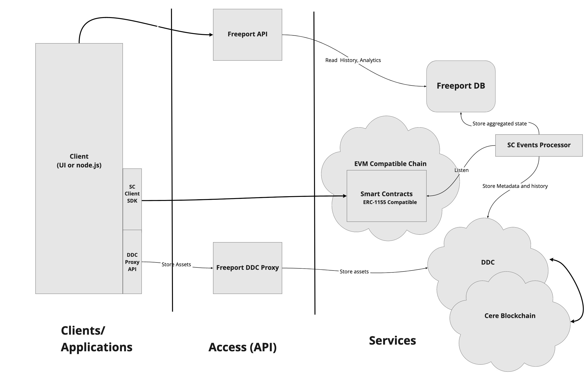

# Cere Freeport/DDC Technical Overview

Cere Freeport is Cere's NFT minting and asset management solution with the following features:

-   Smart contracts for minting
-   Secure asset storage in DDC
-   Configure pricing, roylaty and auction parameters

## Components

The core functionality of Cere Freeport is provided by the Freeport smart contracts and the DDC. However, there are several other components that make developer experience simpler and efficient.

The following diagram shows the various components of the Freeport system:

-   (Add to diagram) Marketplaces: Primary and secondary marketplaces (similar to Cere's DaVinci, Open Sea) with front-end marketing infrastrcture to help users create, discover, sell and trade digital assets.
-   Freeport Smart contracts: The smart contracts provide the onchain functionality to mint, configure and transact multi-asset, potentially multi-owner NFTs. 
-   SC Client SDK: This is a Javascript SDK useful for interaction with the smart contracts from Web UI appications and nodejs-based services.
-   Creator suite: Web UI application for accessing Freeport functionality
-   DDC Proxy: A utility service that makes it easy to encrypt and store big blobs of data in the DDC.
-   DDC: Cere Decentralized Data Cloud, an SLA-backed storage system optimized for NFT and media storage and streams of application events such as gaming events.  The Decenralized design of the system allows anyone to run the nodes that form the DDC and get paid for the services.
-   Freeport DB: A database containing historical smart contract changes to help applications provide faster access to historical data such as provenance, ownership transfer, sales etc.
-   Freeport API Service: A read-only API to access the Freeport DB.
-   (Add to diagram) Freeport Creator Suite: Frontend application that supports NFT marketplaces. It uses the Freeport Smart contracts and services infrastructure to:
    - Create NFTs
    - Setup royalty payment structures
    - Generate interstitial ads on social media
-   (Add to diagram) Creator Content Management System (CMS): A headless content management system that allows editing and management of 
    Creator and NFT information to be used by marketplaces.

# NFT Creation

NFT creation with Freeport involves the following steps:

1. Creating assets in the DDC: This step involves storing the content data inside the DDC, 
   using either the direct DDC interface, or going through a utility service called `DDC Proxy` 
   which simplifies the process or breaking up the content into chunks, encrypting and storing them in the DDC.
2. Minting NFT: Minting an NFT token is a straightforward process of invoking `issue()` function 
   on the Freeport NFT contract. This is a standard ERC1155 contract that assigns an NFT ID to your token.
3. Attaching one or more assets with the token: NFT tokens in Freeport ecosystem do not 
   contain direct references to the assets like in other systems. Instead, one or more Content IDs (CID) 
   are attached to tokens. This is supported by the `NFTAttachment` contract.
4. Configuration of royalties, pricing, auction parameters etc.  Once a token is created, Freeport smart 
   contracts can be used to define the following:
   - Joint accounts: Freeport smart contracts allow specification of how any payments to a creator are to be split. 
     For example, an artist may work with an agent to market their work, and decide to pay a percentage 
     of their income to the agent. Joint accounts allow specification of this split.
   - Royalty structure: The royalty contract may be used to specify that a percentage of every transaction 
     amount be paid to the creator account, potentially a joint account.  A different percentage may be specified 
     for direct sales and secondary sales.

# How It works

## Creation of NFTs

## Marketing NFTs
## Uploading & Downloading Content
## Running on Own Chain
## Running own DDC Nodes

# References